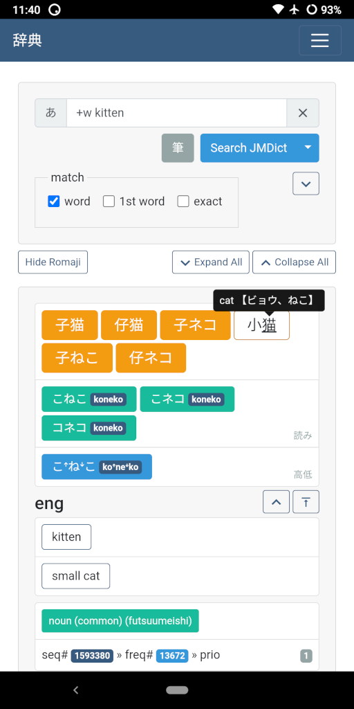

<!-- {{{1

    File        : README.md
    Maintainer  : Felix C. Stegerman <flx@obfusk.net>
    Date        : 2021-01-24

    Copyright   : Copyright (C) 2021  Felix C. Stegerman
    Version     : v0.4.0
    License     : AGPLv3+

}}}1 -->

[](https://github.com/obfusk/jiten/releases)
[](https://pypi.python.org/pypi/jiten)
[](https://pypi.python.org/pypi/jiten)
[](https://github.com/obfusk/jiten/actions?query=workflow%3ACI)
[](https://github.com/obfusk/jiten/actions?query=workflow%3AAndroid)
[](https://www.gnu.org/licenses/agpl-3.0.html)
[](https://ko-fi.com/obfusk)

<!--
[](https://f-droid.org/app/dev.obfusk.jiten)
-->

## jiten - japanese android/cli/web dictionary based on jmdict/kanjidic

→ available online at https://jiten.obfusk.dev

[](https://play.google.com/store/apps/details?id=dev.obfusk.jiten)
[](#not-yet-available)

<!-- [](https://f-droid.org/app/dev.obfusk.jiten) -->

NB: unfortunately, **jiten is not (yet) available in the official
F-Droid repository**.  You can use
[**obfusk's f-droid repo**](https://obfusk.dev/fdroid/repo?fingerprint=2A21B7FFC93B878724B1991C05DAE113C72B93A556C193F49B5D3342884798B7)
instead: this contains the exact same APKs available via Google Play,
as well as occasional beta versions (which are only installed when
selected manually).

## Screenshots

[](screenshot-app.png)
[](screenshot-cli.png)

## Features

* Fine-grained search using
  [regexes](https://docs.python.org/3/library/re.html#regular-expression-syntax)
  (regular expressions)
  - simple searches don't require knowledge of regexes
  - quick reference available in the web interface and android app
* JMDict multilingual japanese dictionary
  - kanji, readings (romaji optional), meanings (english, dutch and/or german) & more
  - pitch accent (from Wadoku)
  - browse by frequency/jlpt
* Kanji dictionary
  - readings (romaji optional), meanings (english), jmdict entries, radicals & more
  - search using
    [SKIP codes](https://en.wikipedia.org/wiki/Kodansha_Kanji_Learner%27s_Dictionary#SKIP)
  - search by radical
  - browse by frequency/level/jlpt
* Example sentences (from Tatoeba)
  - with english, dutch and/or german translation
  - some with audio
* Stroke order
  - input a word or sentence and see how it's written

## Interfaces

* Android app
  - wraps the web interface (running locally on your device) in a webview
  - completely offline, no internet access required
  - easily share and open `jiten.obfusk.dev` links
* Web interface
  - available online at https://jiten.obfusk.dev
  - light/dark mode
  - search history (stored locally)
  - tooltips to quickly see meanings and readings for kanji and words
  - use long press for tooltips on mobile
  - converts romaji to hiragana and between hiragana and katakana
  - can be run on your own computer
* Command-line interface
* WebView GUI
  - wraps the web interface (running locally on your computer)


## CLI

### JMDict

```bash
$ jiten -v jmdict --max 1 --word cat
$ jiten -v jmdict --max 1 --word kat --lang dut
$ jiten -v jmdict --max 1 --exact 誤魔化す

$ jiten -v jmdict +random         # random entry
$ jiten -v jmdict --prio +random  # random "priority" entry"
$ jiten -v jmdict -n 4-5 +random  # random JLPT N4 or N5 entry
```

### Kanji

```bash
$ jiten -v kanji --max 1 --word cat
$ jiten -v kanji --max 1 --exact cat
$ jiten -v kanji --max 1 --word 日
```

### Web Interface

```bash
$ jiten -v serve
```

### Help

```bash
$ jiten --help
```

## WebView GUI for Linux/macOS/Windows

NB: requires [`pywebview`](https://pywebview.flowrl.com)
(Debian/Ubuntu users can `apt install python3-webview`).

```bash
$ jiten-gui
```

## Bugs & Feature Requests

→ [Issue Tracker](https://github.com/obfusk/jiten/issues)

## Questions & Feedback

→ [Discussions](https://github.com/obfusk/jiten/discussions)

→ jiten@obfusk.dev

## Requirements

Python >= 3.5 + Flask + click.

To build the (not yet optional) SQLite PCRE C extension: a C compiler
(e.g. `gcc`/`clang`) and the `sqlite3` & `pcre` libraries & headers.

Basic build tools like `make` and `patch`.

### Debian/Ubuntu

```bash
$ apt install python3-dev build-essential libsqlite3-dev libpcre3-dev
$ apt install python3-flask   # optional: Flask & click w/o pip
```

## Installing

### Using pip

```bash
$ pip install jiten
```

### From git

NB: this installs the latest development version, not the latest
release.

```bash
$ git clone https://github.com/obfusk/jiten.git
$ cd jiten
$ make
$ pip install -e .
```

NB: you may need to add e.g. `~/.local/bin` to your `$PATH` in order
to run `jiten`.

To update to the latest development version:

```bash
$ cd jiten
$ git pull --rebase
$ make
```

## Miscellaneous

### Web Interface on Android

You can also run the web interface locally (& offline) on your android
phone.  First, install [termux](https://termux.com/), then run:

```bash
$ apt install clang python
$ pip install jiten
```

You can then run the web interface with:

```bash
$ jiten serve
```

and open http://localhost:5000 in your browser.

The web interface will keep running until you close termux or reboot.

### Generating the DB

```bash
$ jiten setup
```

### Forcing HTTPS

```bash
$ export JITEN_HTTPS=force
```

### Forcing Domain Name

```bash
$ export JITEN_DOMAIN=jiten.obfusk.dev
```

## License

### Code

© Felix C. Stegerman

[](https://www.gnu.org/licenses/agpl-3.0.html)

### JMDict & KanjiDic

© James William BREEN and The Electronic Dictionary Research and
Development Group

[](https://www.edrdg.org/edrdg/licence.html)

### Wadoku (pitch)

© Ulrich Apel & Wadoku.de contributors

[Non-commercial](https://www.wadoku.de/wiki/display/WAD/Wadoku.de-Daten+Lizenz)

### Tatoeba (sentences & audio)

© Tatoeba contributors

[](https://tatoeba.org/eng/downloads)

Audio by huizi99, Mizu & yomi (CC BY-NC 4.0).

### KanjiVG (radicals)

© Ulrich Apel

[](https://github.com/KanjiVG/kanjivg/blob/master/COPYING)

### Stroke Order Font

© Ulrich Apel, the AAAA project and the Wadoku project

[BSD-3-Clause](https://www.nihilist.org.uk)

### JLPT Data

© Jonathan Waller

[CC-BY](https://www.tanos.co.uk/jlpt/sharing/)

### Kana Tables

© Wikipedia contributors

[](https://en.wikipedia.org/wiki/File:Table_hiragana.svg)
[](https://en.wikipedia.org/wiki/File:Table_katakana.svg)

### Material Design Icons

© Google

[](https://creativecommons.org/licenses/by/3.0/)

<!-- vim: set tw=70 sw=2 sts=2 et fdm=marker : -->
